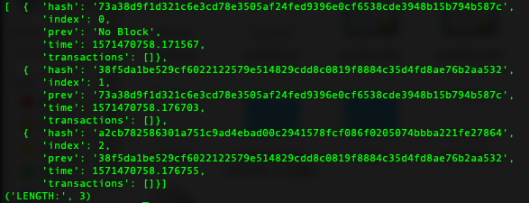

# Frostbite❄️
An Opensource Decentralized Blockchain Platform 🥀

### It uses:
##### SHA256 (Secure Hash Algorithm 256) cryptographic hash algorithm to calculate hash values
##### RSA (Rivest–Shamir–Adleman) asymmetric cryptosystem to generate keys
##### POW (Proof Of Work) consensus algorithm for Blockchain network.

## CONTRIBUTORS:

